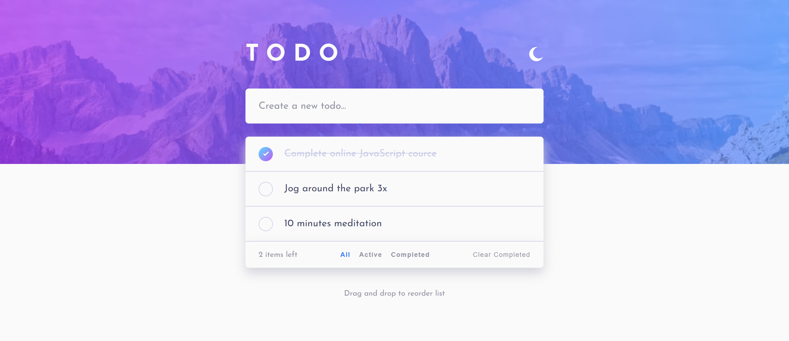
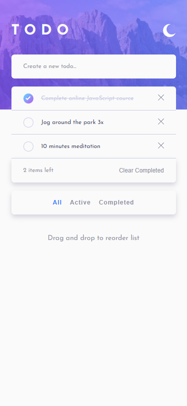
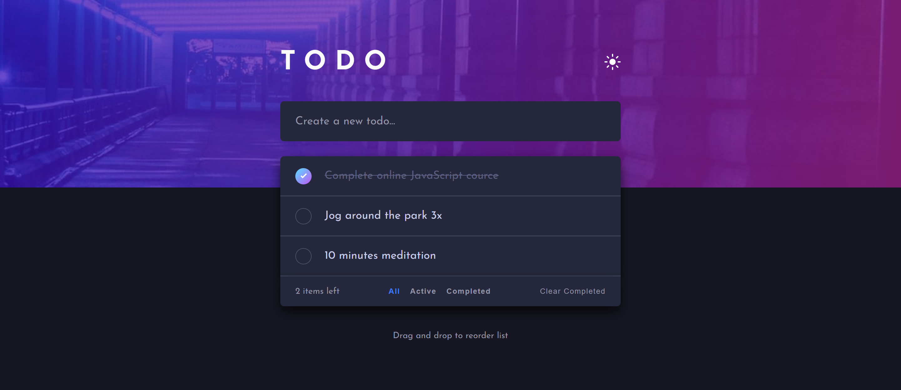
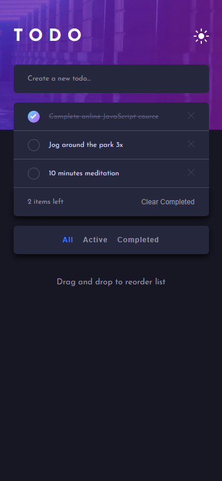

# ✅ Todo App

Простое и удобное приложение для управления списком задач.  
Реализовано на **чистом JavaScript, HTML и CSS** без использования фреймворков.  
Дизайн сверстан **по макету из Figma** с применением подхода **Pixel Perfect**.  
Поддерживает светлую и тёмную темы, сохраняет задачи и выбранную тему в **localStorage**.

## 🚀 Live Demo
👉 [Посмотреть todo app на GitHub Pages](https://lizakein.github.io/todo-app/)

---

## ✨ Функциональность
- Добавление новой задачи  
- Отметка задачи как выполненной  
- Удаление задачи  
- Подсчет количества невыполненных задач  
- Фильтрация задач:
  - 🔹 **All** — все задачи  
  - 🔹 **Active** — только активные  
  - 🔹 **Completed** — только завершенные  
- Очистка всех завершённых задач одной кнопкой  
- Сохранение списка задач в **localStorage**  
- Переключение темы (светлая 🌞 / тёмная 🌙), сохранение выбора в **localStorage**  
- Полностью адаптивный интерфейс  

---

## 🛠️ Технологии
- **HTML5**, **CSS3**, **JavaScript (ES6)**  
- Работа с DOM API  
- Использование **localStorage** для сохранения данных  
- Адаптивная вёрстка  
- Верстка по макету из Figma (Pixel Perfect)
- Управление состоянием фильтра и задач  

---

## 📦 Установка и запуск
1. Склонируйте репозиторий:
   ```bash
   git clone https://github.com/lizakein/todo-app.git
2. Откройте файл index.html в браузере
(или перейдите по [Live Demo](https://lizakein.github.io/todo-app/))

---

## 🎯 Чему я научился
- Реализовывать CRUD-функциональность (создание, обновление, удаление элементов)
- Организовывать логику работы приложения через фильтры
- Использовать localStorage для сохранения данных
- Добавлять темизацию с переключением светлой/тёмной темы
- Работать с событиями DOM и динамически обновлять интерфейс
- Верстать по макету из Figma с соблюдением принципа Pixel Perfect

---

# 📸 Скриншоты

**Светлая тема**





**Темная тема**





---

## 📌 Статус проекта

✅ Завершен

💡 Возможные улучшения: drag-and-drop сортировка задач, интеграция с сервером, анимации при добавлении/удалении
